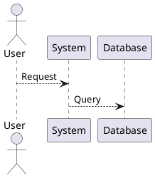

# OMAG Documentation

This directory contains the complete documentation for the OMAG Storage Engine.

## Building Documentation Locally

### Prerequisites

- Python 3.8+
- pip (Python package manager)

### Installation

```bash
# Install documentation dependencies
pip install mkdocs mkdocs-material pymdown-extensions

# Or use requirements file (create as needed)
pip install -r requirements-docs.txt
```

### Building

```bash
# Build the documentation site
mkdocs build --config-file mkdocs.yml

# This creates a `site/` directory with static HTML files
```

### Live Preview

```bash
# Serve documentation locally with live reload
mkdocs serve --config-file mkdocs.yml

# Visit http://localhost:8000 in your browser
```

When you make changes to markdown files, the site automatically rebuilds and reloads.

## Documentation Structure

```
docs/
├── index.md                          # Homepage
├── mkdocs.yml                        # MkDocs configuration
├── requirements-docs.txt             # Python dependencies
├── architecture/                     # Architecture deep-dives
│   ├── overview.md                   # Overall architecture
│   ├── bplus-tree.md                 # B+ Tree design
│   ├── lsm-tree.md                   # LSM Tree design
│   ├── buffer-pool.md                # Buffer pool details
│   ├── transactions.md               # Transaction system
│   └── concurrency.md                # Concurrency control
├── features/                         # Feature overview
│   └── index.md                      # All storage engine features
├── api-reference/                    # API documentation
│   ├── index.md                      # API overview
│   └── (generated files added via CI)
├── api/                              # Component API docs
│   ├── btree.md                      # B+ Tree API
│   ├── buffer-pool.md                # Buffer Pool API
│   ├── lsm-tree.md                   # LSM Tree API
│   ├── transactions.md               # Transactions API
│   └── concurrency.md                # Concurrency API
├── packages/                         # Package overview
│   └── overview.md                   # Internal package structure
├── contributing.md                   # Contribution guide
└── images/                           # Documentation images
```

## Creating New Documentation

### Markdown Convention

- Use `.md` extension
- Start with H1 heading: `# Title`
- Use relative links to other docs: `[Link](../path/to/file.md)`
- Use code blocks with language: ` ```go ... ``` `

### Adding Pages

1. Create markdown file in appropriate directory
2. Add entry to `nav:` section in `mkdocs.yml`
3. Run `mkdocs serve` to verify rendering

Example entry in mkdocs.yml:
```yaml
nav:
  - My New Page: path/to/file.md
```

## Documentation Guidelines

### Writing Style

- **Clarity**: Explain concepts in simple terms
- **Examples**: Include code snippets for API docs
- **Accuracy**: Keep in sync with source code
- **Completeness**: Document edge cases and limitations

### Code Examples

```python
# Use appropriate language highlight
# Go examples for storage engine code:
```
# Good example format
```bash
# Shell examples show commands and output
$ go test ./...
ok	github.com/rodrigo0345/omag/...
```

### Diagrams

Use ASCII art or PlantUML for diagrams:

```
Plant UML in code block:


## CI/CD Integration

The documentation is automatically:
- **Built**: On every push to `main`
- **Deployed**: To GitHub Pages automatically
- **Generated**: API docs extracted from source code

See `.github/workflows/docs.yml` for automation details.

### Manual Deployment

If needed, you can manually deploy:

```bash
# Build static site
mkdocs build

# Files are ready in `site/` directory
# Push to gh-pages branch:
mkdocs gh-deploy --config-file mkdocs.yml
```

## Updating Go API Documentation

The CI/CD workflow automatically generates API documentation:

1. **Extract docs**: Runs `go doc ./internal/...` commands
2. **Format docs**: Converts output to Markdown
3. **Include docs**: Adds to api/*.md files
4. **Deploy**: Publishes to GitHub Pages

To manually generate:
```bash
# Extract Go documentation
go doc ./internal/storage/btree > docs/api/btree-generated.md
go doc ./internal/storage/buffer > docs/api/buffer-pool-generated.md
```

## Viewing Deployed Documentation

When pushed to `main`, docs are available at:
```
https://rodrigo0345.github.io/omag/
```

## Troubleshooting

### Port 8000 Already in Use
```bash
# Use different port
mkdocs serve --config-file mkdocs.yml --dev-addr 127.0.0.1:8001
```

### Build Errors
```bash
# Reinstall dependencies
pip install --upgrade mkdocs mkdocs-material pymdown-extensions
```

### Broken Links
```bash
# Test links (install linkchecker if not present)
linkchecker site/index.html
```

## Contributing to Documentation

See [Contributing Guide](contributing.md) for details on:
- Submitting documentation PRs
- Code style for documentation
- Testing documentation changes
- Updating API references

## License

Documentation is part of the OMAG project. See main repository for license details.

---

For questions or suggestions, open an issue on [GitHub](https://github.com/rodrigo0345/omag).
